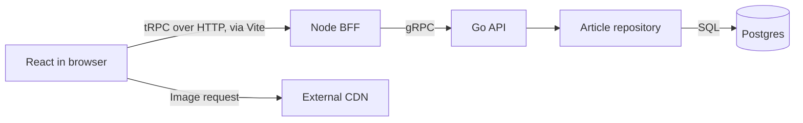

# Architecture

This document describes the current implementation. See [README.md](README.md) for setup and exposed ports, and [verification](docs/verification.md) for checks.

## Components and ownership

| Component | Responsibility | Location |
| --- | --- | --- |
| React client | Article list and detail pages, loading states, and status badges | `frontend/src/client/` |
| Node BFF | tRPC procedures, input validation, gRPC calls, response and error mapping | `frontend/src/server/` |
| Go API | gRPC handlers, article reads, and asynchronous status-change requests | `backend/internal/articles/` |
| Postgres | Article data, including the `disabled` flag | `backend/internal/database/migrations/` |
| Queue publisher | Publishes status-change requests to SQS | `backend/internal/queue/` |
| External services | Queue, status consumer, and image CDN | `external/` |

The Compose `frontend` service runs Vite and the Node BFF. React runs in the browser. Vite serves the client and proxies `/_trpc` to the BFF. The BFF calls `api:8081` inside the Compose network; `localhost:8091` is the host-facing mapping for the same Go API.

The API applies embedded database migrations at startup. The external consumer updates the same database, but is treated as another team's service. Its interface and delivery guarantees are documented in [external/README.md](external/README.md).

## Reading an article

For an article detail request, follow:

1. [React route](frontend/src/client/routes/articles.$articleId.tsx): requests `articles.getArticleDetails` with the route's article ID. TanStack Query manages the query and cached data.
2. [tRPC router](frontend/src/server/trpc/routers/articles/articles-router.ts): validates the ID with Zod and calls the generated gRPC client.
3. [Go service](backend/internal/articles/service.go): handles `GetArticleDetails`, delegates the lookup, and constructs the protobuf response.
4. [Repository](backend/internal/articles/repository.go): selects the article by ID, returning `ErrNotFound` when no row exists.
5. [BFF response mapping](frontend/src/server/trpc/routers/articles/articles-mapping.ts) and [error mapping](frontend/src/server/trpc/routers/articles/articles-errors.ts): convert protobuf data and upstream errors for the client. The Go service maps a missing article to gRPC `NotFound`, which the BFF maps to tRPC `NOT_FOUND`.

The article list follows the same layers through `GetArticles`. Images are loaded directly from the CDN, using the configured image base URL and the stored relative path.

## Contracts

- React and the BFF share the TypeScript `AppRouter` type. tRPC does not require client code generation; input validation still happens at runtime.
- The BFF and Go API share [protobuf definitions](backend/api/proto/article_service.proto). `make generate` produces Go code under `backend/pkg/articles/api/` and TypeScript code under `frontend/src/server/generated/grpc/`.
- The Go API exposes `GetArticles`, `GetArticleDetails`, and `RequestArticleStatusChange`. The status-change RPC accepts an article ID and an explicit disable/enable action; success means queue acceptance only.

## Status processing

The existing external path is `queue → consumer → Postgres`. The consumer accepts `disable` and `enable` messages and sets the article's `disabled` flag. Repeated application of the same action is idempotent; opposite actions can have different results depending on their order.

The Go entrypoint injects the publisher into the article service. `RequestArticleStatusChange` validates the UUID shape and action, checks article existence, and publishes the external JSON contract without updating the database. Database checking and publishing share a request context bounded to five seconds (or a shorter caller deadline). Invalid input and missing articles are rejected before publishing. A publish error returns an unconfirmed acceptance outcome; cancellation cannot undo a message already accepted by the queue. The BFF validates and maps the action, and the React detail page exposes the controls.

Queue acceptance and database application are separate events. Delivery is delayed, at least once, and unordered. A successful publish cannot prove that the requested state has been applied. The exact message shape, failure handling, and queue inspection commands belong to the [external contract](external/README.md).

### Client confirmation

The detail control keeps the requested action separately from the observed article. After acceptance it reads immediately, then approximately every two seconds, stopping after 30 seconds or on page exit. Confirmation reads bypass cached values and update the TanStack cache; the list is invalidated after confirmation. Requests do not overlap within the polling loop.

An unconfirmed outcome offers `Check status`, which only reads. A successful fresh read that still differs permits `Retry request` for the same action. Read failures do not prove mutation failure. There is no automatic mutation retry, optimistic status change, or operation persistence across reloads. These controls do not guarantee ordering across delayed messages or other clients.
