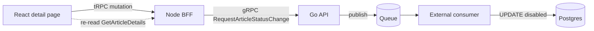

# Submission notes

## 1. What I built

Editors can disable and re-enable an article from the detail page. The API does not write
the change itself: it validates the request, checks that the article exists, and publishes
the agreed message to the queue. The external consumer applies it to Postgres later, and the
page finds out by reading the article again. Nothing under `external/` was changed.

- **Contract**: one new RPC, `RequestArticleStatusChange(id, action)`, returning an empty
  response. Generated Go and TypeScript clients are committed with the `.proto` change.
- **Go**: validates the UUID shape and action, rejects missing articles before publishing,
  builds the consumer's JSON contract, and reports a failed publish as an unconfirmed
  outcome rather than a rejection.
- **BFF**: one tRPC mutation with Zod validation, mapped onto the generated enum, using the
  existing gRPC-to-tRPC error mapping.
- **React**: a status control on the detail page that sends the request, then confirms it
  by re-reading the article. The status badge itself is unchanged.

Running the stack is unchanged: `make up`. `make check` runs the Go and frontend tests and
type checks locally; CI runs the same targets. See [ARCHITECTURE.md](ARCHITECTURE.md) for
the layers and [docs/verification.md](docs/verification.md) for repeatable checks.

## 2. What the editor sees

The badge always shows the last **observed** state read from the API. The request's progress
is shown on a separate line, so an accepted request is never displayed as an applied change.

| Observation | Shown to the editor |
| --- | --- |
| Request in flight | Badge unchanged, "Sending request…", buttons disabled |
| Queue accepted the request | Badge unchanged, "Request accepted. Waiting for the update…" |
| A fresh read shows the requested state | Badge updates, "Requested status observed." |
| Input rejected (`BAD_REQUEST`, `NOT_FOUND`) | "Request rejected. The article may be missing or the input invalid." |
| Transport or upstream failure | "We couldn't confirm whether your request was accepted." plus **Check status** |
| No matching read within 30 seconds | "Update not confirmed yet." plus **Check status** |
| Check status: fresh read still differs | **Retry request** for the same action appears |

Alternatives: an optimistic badge change was rejected because it would show a state that
may never be applied. The simplest honest option, leaving the editor to refresh by hand and
read the badge, would have been my minimum version; since the time allowed for it, I went one
step further and had the page confirm the change itself with bounded polling.

Confirmation reads start immediately after acceptance and repeat about every two seconds
for up to 30 seconds. They bypass the five-minute query cache, never overlap, and stop when
the editor leaves the page. **Check status** only reads; **Retry request** resends the same
action and is offered only after a fresh read, never on a cached value. There is no
optimistic update and no automatic resend. The timings are starting values chosen around
the default five-second queue delay, not a guarantee of when the consumer applies a change.

## 3. Decisions and assumptions

- **Validate before publishing.** The BFF rejects malformed input; Go validates again and
  checks that the article exists, so no message is published for an article that cannot be
  updated. A deletion after that check is not prevented.
- **Acceptance is not application, and unknown is not failure.** A successful RPC means the
  queue accepted the message and nothing more. A publish error, timeout, or dropped
  connection is reported as "unconfirmed", because the message may still have been accepted.
  Only validation and missing-article errors are shown as rejections.
- **Confirm by reading, not by waiting.** The existing `GetArticleDetails` RPC is the only
  signal available under the current contract. A matching read shows the current state; it
  cannot prove which queued message produced it.
- **Block further changes on the same page while a request is pending.** This reduces
  competing messages on an unordered queue from one editor. It does not coordinate other
  tabs or users, and a reload reads the current article rather than restoring a pending
  operation.

## 4. Go operational improvements

The Go service worked but was not ready to run in production: it stopped abruptly, had no
deadlines on its dependencies, and logged too little to explain a failed request. I chose
three changes that address how the service fails and how a failure can be traced, each of
which can be verified in the Compose environment.

- **Bounded graceful shutdown.** SIGINT/SIGTERM drains in-flight RPCs for up to seven
  seconds before forcing a stop, then closes the database. A `Serve` failure exits non-zero
  instead of being silently dropped. A test drives a real RPC through an in-memory gRPC
  server and checks both the drain and the forced-stop path.
- **Deadlines on the new write path.** The existence check and the publish share a
  five-second context, or the caller's shorter deadline, so a slow database or queue cannot
  hold a request open indefinitely.
- **Structured logs at failure points.** Publish and existence-check failures log
  the article ID and error with `slog`, with the action included for publish failures.
  The caller receives a stable message without infrastructure details.

The next items, listed in section 5, would be to apply the same validation and deadlines to
the existing read RPCs, add a gRPC health check, and move the database URL out of source.

## 5. Not done, and why

The following limitations remain, with the next steps I would prioritise.

| Item | Why it can wait | Next step |
| --- | --- | --- |
| Ordering of competing changes | Not solvable in this codebase alone: the queue is unordered and the consumer is another team's. An old `disable` can still overwrite a newer `enable`. | Agree on versioned commands, or a consumer-side check that rejects stale ones, with the consumer's owners. |
| Durable operation tracking | The current flow works without it because the page confirms by reading the article. | Add an operations table if recovery across reloads or devices is required. |
| Validation and deadlines on existing read RPCs | ID validation is already enforced by the BFF; propagating deadlines through existing DB reads remains a follow-up. | Apply the same validation and context handling as the new RPC. |
| Health check and externalised configuration | No observable effect in the local Compose flow. | Register the gRPC health service; read the database URL and listen address from the environment. |

## 6. How I worked with AI tools

I set the repository up the way I would for any new project before writing feature code.
`AGENTS.md` holds a short set of rules plus an index of where to look, and the detail lives
in `ARCHITECTURE.md`, `docs/verification.md` and `external/README.md`, so that only the
relevant document is loaded for a given change. The rules encode the constraints that matter
most here: do not touch `external/`, never present a queue publish as an applied change,
keep changes inside the requested scope, and regenerate clients with every contract change.

I reviewed the generated changes and used tests, type checks and manual verification as
feedback. `make check` runs the Go and frontend tests and type checks; CI runs the same targets.

Design decisions were mine. I traced the existing read path layer by layer until I could
explain it, wrote down the problem, options and chosen approach before each implementation
step, and had the assistant implement only decisions I had accepted. Findings outside the
requested scope, such as the missing ID validation on the existing detail RPC, went to the
follow-up list instead of widening the change.

## 7. Verification

- **Automated**: `make check` passes locally: Go service and shutdown tests, BFF mapping and
  error tests, confirmation-loop tests, Go vet, and TypeScript type checks. CI runs the same
  targets.
- **Manual, against the Docker stack**: the badge stays on Live while a disable is pending
  and changes only after a fresh read; with the queue delay raised to 45 seconds the UI
  stopped confirming at 30 seconds and offered Check status and Retry request.
- **Not covered by these checks**: browser automation, fault injection beyond stubbed
  failures, and multi-client or dead-letter replay scenarios.
